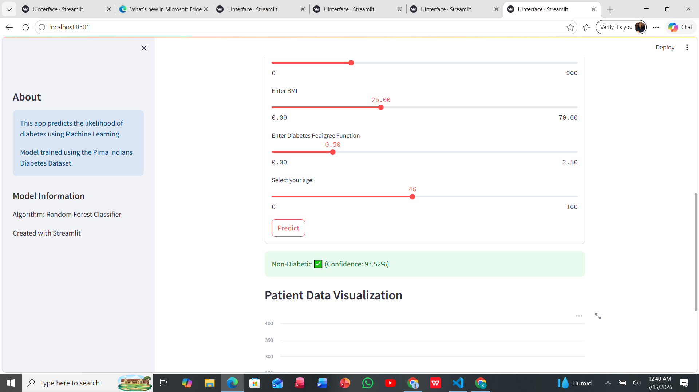
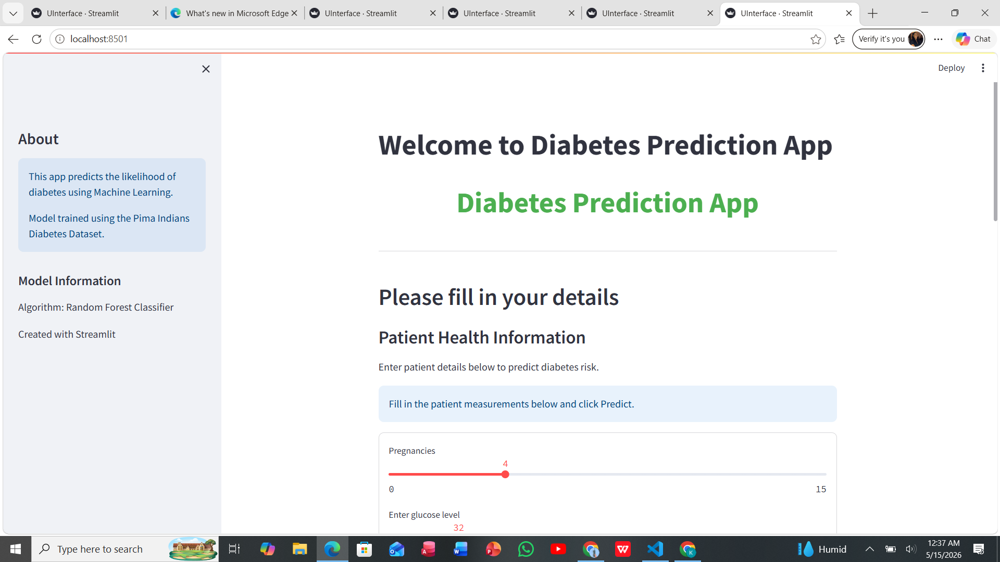
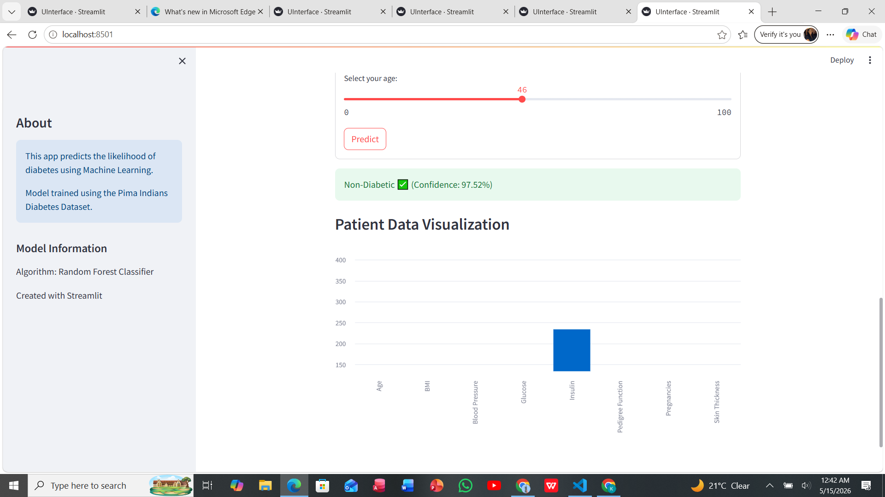
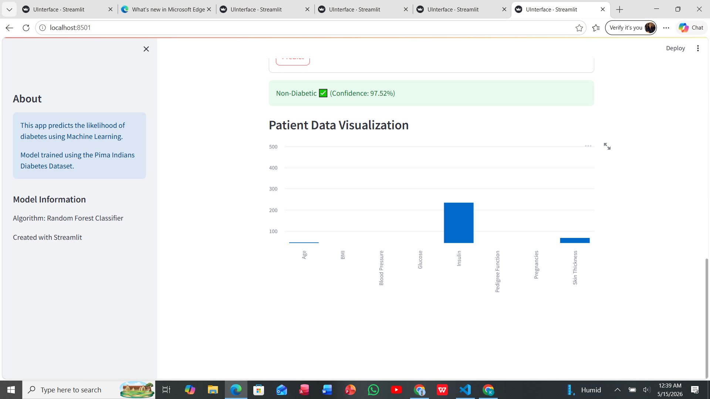

# Diabetes Prediction Streamlit App

A machine learning web application that predicts the likelihood of diabetes using patient health data.

---

## Features

### Diabetes prediction using Machine Learning


### Streamlit Web Interface


### Confidence Score Display


### Interactive Charts and Visualizations


---

## Technologies Used

- Python
- Pandas
- NumPy
- Scikit-learn
- Streamlit
- Matplotlib

---

## How to Run

```bash
streamlit run StreamlitApp/Diabetes/UI/UInterface.py
Author

Lydia Kisitu